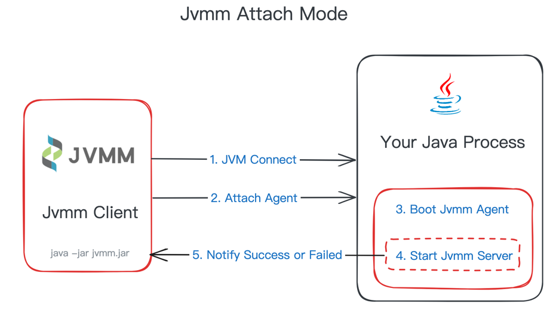
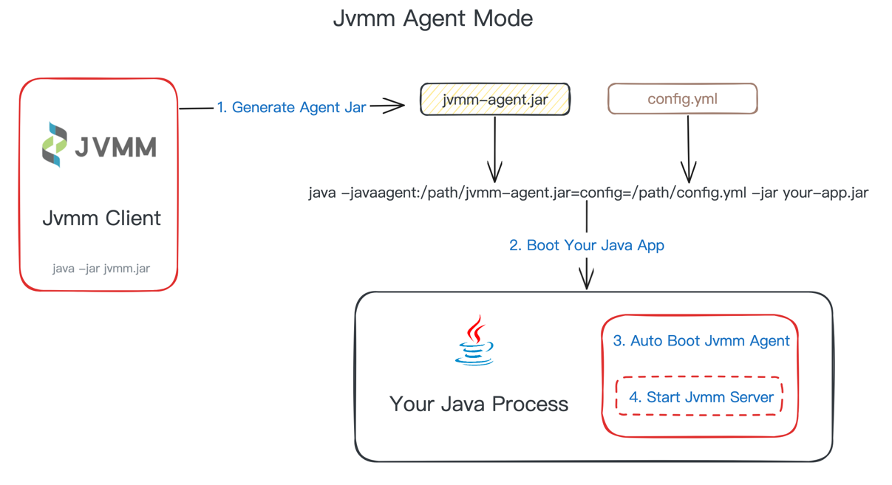
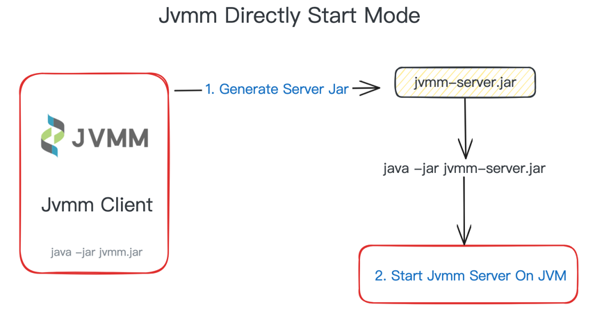
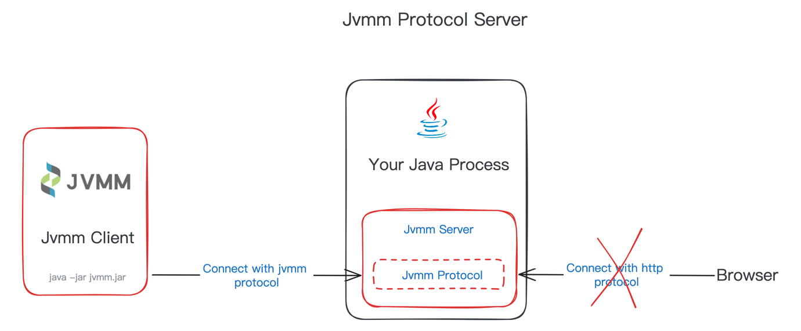
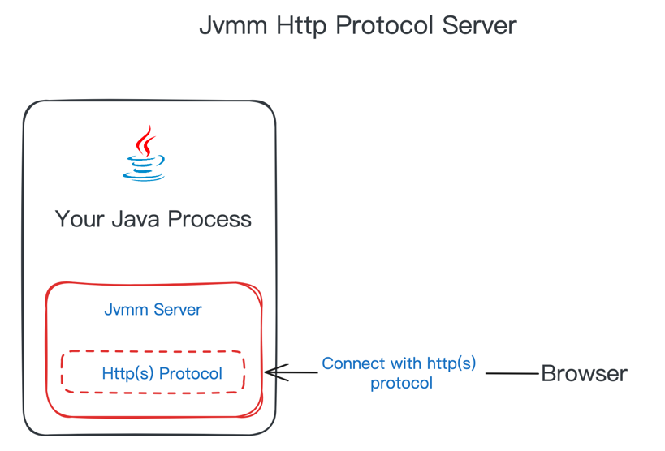
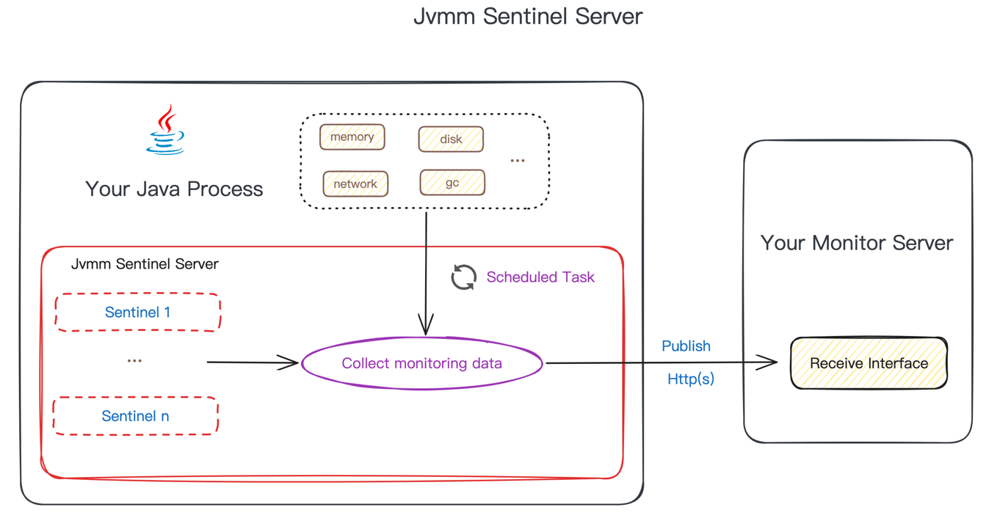
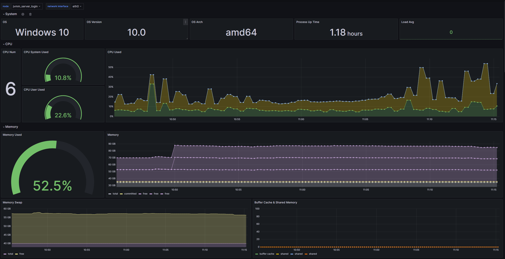
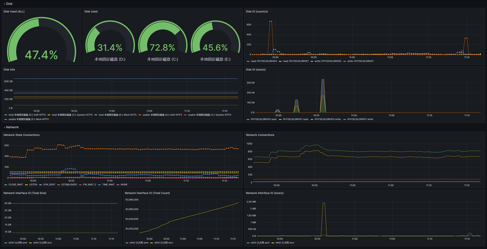
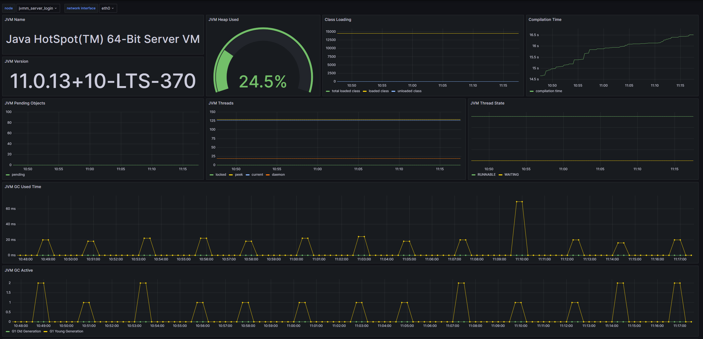
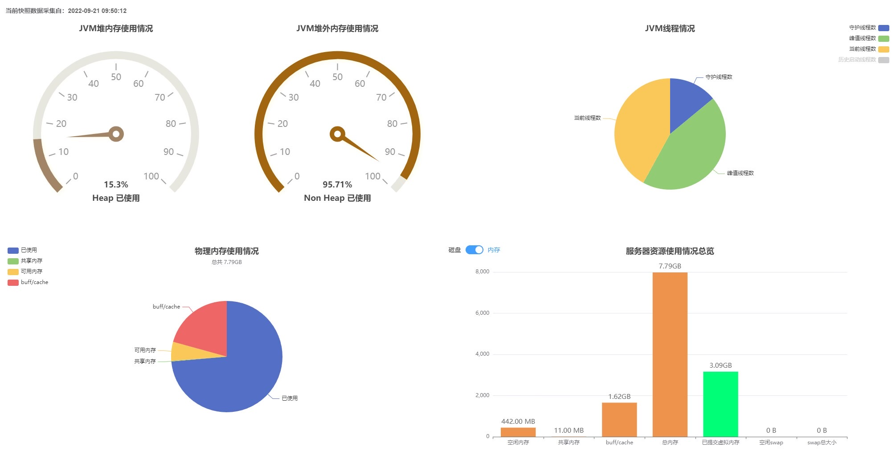

<div align=center>

</div>

<div align="center">


[](https://search.maven.org/search?q=g:io.github.tzfun.jvmm)

</div>

JVMM（JVM Monitor）是一个提供Java虚拟机和操作系统服务式监控的工具，拥有丰富的数据采集功能：OS（内存、CPU、磁盘状态及IO、网卡状态及IO等）、
JVM（内存、线程、线程池、内存池、GC、类加载器等），还提供生成火焰图、Java代码热更、反编译等功能。适合用于服务健康监控、程序调优、问题排查、性能测试等场景。

# 功能支持

* 支持Java虚拟机数据采集：
  * 进程信息 
  * 内存信息：堆内、堆外内存使用情况，Manager、Pool信息
  * 线程信息：堆栈、锁、死锁检测、CPU Time、Wait Time等
  * 线程池信息：配置参数、状态、任务统计等
  * GC信息：分代收集器信息、GC次数、GC耗时等
  * 类加载信息：类加载统计、类加载器、JIT
* 支持操作系统数据采集：内存状态、CPU负载、磁盘状态及IO吞吐率、网卡状态及IO吞吐率、端口检测
* 支持火焰图生成，采样事件包括CPU、内存分配、线程栈、Java方法及native方法调用栈等
* 支持**Prometheus**、**Grafana**一键接入
* 支持Java代码反编译生成
* 支持Java代码热更新（可指定ClassLoader）
* 支持远程执行GC
* 支持远程执行JDK自带工具命令：jstat、jstack、jinfo、jmap、jcmd等
* 提供三种服务模式：
  * jvmm服务：独有RPC协议，需使用jvmm客户端远程连接调用，安全可靠
  * http服务：提供Http接口，不限开发语言远程调用
  * 哨兵服务：定时采集数据并上报给订阅者，支持推送给 Prometheus
* 支持无感知跨进程attach到Java进程，远程连接，Java Agent启动，server独立运行启动，可自定义开发
* 支持 JDK 8+
* 支持 Linux/Mac/Windows

# 快速体验

请前往[releases](https://github.com/tzfun/jvmm/releases)下载最新版的jvmm，然后将其解压

> 小Tips：Jvmm 部分功能依赖于本地环境中的 jdk，请确保你的环境中安装的是 jdk 而不只是 jre，简单验证：在你的环境中执行`jps -l`，
> 如果可正常执行并输出结果则表示环境OK，否则可能无法运行Jvmm。

首先执行下面指令生成服务jar包
```shell
java -jar jvmm.jar -m jar -s
```

然后启动server，启动时请注意你的jdk版本
```shell
# 启动server，jdk 8使用下面命令
java -jar jvmm-server.jar

# jdk 9+ 为确保成功运行建议使用下面命令
java -jar --add-opens java.base/jdk.internal.loader=ALL-UNNAMED \
          --add-opens jdk.zipfs/jdk.nio.zipfs=ALL-UNNAMED \
          --add-opens java.base/java.net=ALL-UNNAMED \
          --add-opens java.management/sun.management=ALL-UNNAMED \
          jvmm-server.jar
```

如果启动成功 Jvmm Server 将会默认运行在 **5010** 端口，然后你需要在当前目录新起一个窗口执行：
```shell
java -jar jvmm.jar -m client -a 127.0.0.1:5010
```

如果连接 server 成功那么你就进入了客户端模式，你可以输入下面指令去采集进程数据，当然输入`help`可以查看该模式下所有可执行指令的使用方法。
```shell
info -t process
```

[这里](EXAMPLE.md)提供了Jvmm client模式下采集的数据样例，Jvmm提供的功能远不止如此，更多功能请阅读 Jvmm [使用文档](#使用文档)。

# 使用文档

Jvmm的核心数据采集功能在 `core` 模块，提供的服务式功能在 `server` 模块，根据你的使用场景可选择下面两种使用方式：

- 直接使用 Jvmm server
- 基于 `core` 模块二次开发（功能更全）

## Server使用

### 一、Server服务

首先你需要了解 server 能干嘛？server提供了三种服务模式，在使用之前你需要选择哪种模式更适合你，下面简单介绍一下三种服务模式：

1. Jvmm server：提供独有通信协议远程调用服务，可以在自己的项目中使用 JvmmConnector 连接，也可直接使用Jvmm客户端连接
2. Http server：提供Http接口远程调用服务，不限语言
3. Sentinel server：哨兵模式，定时采集指定的数据项并通过 Http 接口传输给第三方

任何一种服务模式都离不开配置文件 [jvmm.yml](server/src/main/resources/jvmm.yml)，通过`server.type`来配置你选择了哪个模式或哪几个模式，
它们可以**同时运行**，各个模式的具体配置分别对应 `server.jvmm`，`server.http`，`server.sentinel`。
```yaml
server:
  type: jvmm,http,sentinel  # 支持同时开启多种模式
  jvmm:
    # ...
  http:
    # ...
  sentinel:
    # ...
```

### 二、配置文件

默认配置请见 [jvmm.yml](server/src/main/resources/jvmm.yml)，其中配置信息请见配置文件中的注释。

### 三、启动Server

Jvmm提供了四种方式来启动你的 server：

1. Attach方式启动：使用客户端工具本地 attach 到目标 Java 进程
2. Java Agent方式启动：目标Java进程启动时以 Java Agent 的方式载入（`-javaagent`参数）
3. 直接启动`jvmm-server.jar`（不支持反编译和代码热更功能）
4. 自己项目中引入 maven 或 gradle依赖，一行代码即可启动

> 注意！！！
>
> 无论是你用哪种方式启动Server，如果你的运行环境是jdk 9+以上，为确保成功运行建议在启动时添加以下JVM参数
```shell
--add-opens java.base/jdk.internal.loader=ALL-UNNAMED
--add-opens jdk.zipfs/jdk.nio.zipfs=ALL-UNNAMED
--add-opens java.base/java.net=ALL-UNNAMED
--add-opens java.management/sun.management=ALL-UNNAMED
```

#### I. Attach方式启动



运行 jvmm.jar，选择**attach**模式

```shell
java -jar jvmm.jar -m attach -c ./jvmm.yml
```

然后会提示你选择目标进程的序号，选择后便会在目标进程中启动server。

如果你已经知道目标进程的 pid，你可以直接指定它：
```shell
java -jar jvmm.jar -m attach -c ./jvmm.yml -pid 80080
```

#### II. Java Agent方式启动



Java Agent方式你需要先生成所需的jar包，使用 `-a` 参数指定生成 `agent`：
```shell
# 如果你的宿主程序中包含了 SLF4J 的实现（例如 logback），需要在生成时使用 -e 参数排除掉jvmm自带的 slf4j 实现
java -jar jvmm.jar -m jar -a -e logger

# 如果你的宿主程序中没有 SLF4J 的实现，无需排除 logger
java -jar jvmm.jar -m jar -a
```

执行之后会在同级目录下生成对应的文件：`jvmm-agent.jar`，然后在启动目标程序（假设为app.jar）时
添加`-javaagent`参数，格式如下：

```textmate
java -javaagent:<jvmm-agent.jar路径>=config=<jvmm.yml路径> -jar your-app.jar
```

例如：
```shell
java -javaagent:/path/jvmm-agent.jar=config=/path/jvmm.yml -jar app.jar
```

> 为兼容使用外部 server 的功能，完整的javaagent格式为：
> 
> `-javaagent:<jvmm-agent.jar路径>=server=<jvmm-server.jar路径>;config=<jvmm.yml路径>`

当你的程序启动之后 Jvmm 就会以Agent的方式启动

#### III. 直接启动



如果你不想依附于任何宿主程序，可以选择单独启动一个 Jvmm server，比如在监控物理机器的场景下。

首先需要生成启动的jar依赖，使用 `-s` 参数指定生成 `server`：
```shell
java -jar jvmm.jar -s
```

执行结束后会在同级目录生成一个 `jvmm-server.jar`，然后启动server，启动时请注意你的jdk版本

```shell
# 启动server，jdk 8使用下面命令
java -jar jvmm-server.jar

# jdk 9+ 为确保成功运行建议使用下面命令
java -jar --add-opens java.base/jdk.internal.loader=ALL-UNNAMED \
          --add-opens jdk.zipfs/jdk.nio.zipfs=ALL-UNNAMED \
          --add-opens java.base/java.net=ALL-UNNAMED \
          --add-opens java.management/sun.management=ALL-UNNAMED \
          jvmm-server.jar
```

#### IV. 引入项目工程启动

如果你想在自己的项目工程中使用server，需要先引入maven依赖

```xml
<dependencies>
  <dependency>
    <groupId>io.github.tzfun.jvmm</groupId>
    <artifactId>jvmm-server</artifactId>
    <version>${jvmm-version}</version>
  </dependency>

<!-- jvmm日志依赖，如果你的项目中有 SLF4J、Log4J2、Log4J中任意一个依赖，可以去掉此依赖 -->
  <dependency>
    <groupId>io.github.tzfun.jvmm</groupId>
    <artifactId>jvmm-logger</artifactId>
    <version>${jvmm-version}</version>
  </dependency>  
</dependencies>
```

一行代码启动server
```java
import org.beifengtz.jvmm.server.ServerBootstrap;

public class Jvmm {
  public static void main(String[] args) {
    ServerBootstrap.getInstance().start();
  }
}
```

当然上面的启动方式会使用默认的配置，一般都需要自定义配置，`getInstance`方法可以传入一个 `org.beifengtz.jvmm.server.entity.conf.Configuration` 对象，
通过构造 Configuration 既可以实现自定义配置。

**使用 JvmmConnector 连接 Jvmm Server** [ServerConveyDemo.java](demo/src/main/java/org/beifengtz/jvmm/demo/ServerConveyDemo.java)

### 四、Server接口文档

当Server以`jvmm`或`http`模式启动之后，你可以远程调用内置的接口。

#### I. Jvmm接口



Jvmm Service提供了以下API接口：

| Type                                     | Data                                                                                                                                      | Description                                                                           |
|------------------------------------------|-------------------------------------------------------------------------------------------------------------------------------------------|---------------------------------------------------------------------------------------|
| JVMM_COLLECT_SYS_INFO                    | /                                                                                                                                         | 采集操作系统信息                                                                              |
| JVMM_COLLECT_SYS_MEMORY_INFO             | /                                                                                                                                         | 采集操作系统内存数据                                                                            |
| JVMM_COLLECT_SYS_FILE_INFO               | /                                                                                                                                         | 采集操作系统磁盘分区使用情况数据                                                                      |
| JVMM_COLLECT_PROCESS_INFO                | /                                                                                                                                         | 采集当前进程数据                                                                              |
| JVMM_COLLECT_DISK_INFO                   | /                                                                                                                                         | 采集物理机磁盘数据                                                                             |
| JVMM_COLLECT_DISK_IO_INFO                | /                                                                                                                                         | 采集物理机磁盘IO及吞吐量数据                                                                       |
| JVMM_COLLECT_CPU_INFO                    | /                                                                                                                                         | 采集物理机CPU负载数据                                                                          |
| JVMM_COLLECT_NETWORK_INFO                | /                                                                                                                                         | 采集物理机网卡信息及IO数据                                                                        |
| JVMM_COLLECT_PORT_STATUS                 | JsonArray，其元素为端口号                                                                                                                         | 采集物理机器端口使用情况                                                                          |
| JVMM_COLLECT_JVM_CLASSLOADING_INFO       | /                                                                                                                                         | 采集JVM类加载信息                                                                            |
| JVMM_COLLECT_JVM_CLASSLOADER_INFO        | /                                                                                                                                         | 采集JVM类加载器信息                                                                           |
| JVMM_COLLECT_JVM_COMPILATION_INFO        | /                                                                                                                                         | 采集JVM编译信息                                                                             |
| JVMM_COLLECT_JVM_GC_INFO                 | /                                                                                                                                         | 采集JVM垃圾收集器信息                                                                          |
| JVMM_COLLECT_JVM_MEMORY_MANAGER_INFO     | /                                                                                                                                         | 采集JVM内存管理器信息                                                                          |
| JVMM_COLLECT_JVM_MEMORY_POOL_INFO        | /                                                                                                                                         | 采集JVM内存池信息                                                                            |
| JVMM_COLLECT_JVM_MEMORY_INFO             | /                                                                                                                                         | 采集JVM内存使用情况                                                                           |
| JVMM_COLLECT_JVM_THREAD_INFO             | /                                                                                                                                         | 采集JVM线程统计数据                                                                           |
| JVMM_COLLECT_JVM_THREAD_STACK            | 见[ThreadInfoDTO](server/src/main/java/org/beifengtz/jvmm/server/entity/dto/ThreadInfoDTO.java)                                            | 采集指定JVM线程堆栈数据                                                                         |
| JVMM_COLLECT_JVM_THREAD_DETAIL           | JsonArray，其元素为线程ID                                                                                                                        | 采集JVM线程详情信息（CPU Time、Block Time、Locks等）                                               |
| JVMM_COLLECT_JVM_THREAD_POOL             | JsonObject，其属性为：classLoaderHash(String), clazz(String), instanceField(String), field(String)                                              | 采集JVM线程池信息                                                                            |
| JVMM_COLLECT_JVM_THREAD_ORDERED_CPU_TIME | JsonObject，其属性为：type(String, stack\|info), durationSeconds(int)                                                                           | 采集JVM线程在一定时间内CPU占用时间情况                                                                |
| JVMM_COLLECT_JVM_DUMP_THREAD             | /                                                                                                                                         | dump所有线程堆栈数据                                                                          |
| JVMM_COLLECT_BATCH                       | [CollectionType](core/src/main/java/org/beifengtz/jvmm/core/CollectionType.java)[]                                                        | 根据选项批量采集数据                                                                            |
| JVMM_EXECUTE_GC                          | /                                                                                                                                         | 执行gc                                                                                  |
| JVMM_EXECUTE_JAVA_PROCESS                | /                                                                                                                                         | 列出所有Java进程                                                                            |
| JVMM_EXECUTE_JVM_TOOL                    | String                                                                                                                                    | 执行jvm tool命令                                                                          |
| JVMM_EXECUTE_JAD                         | JsonObject，其属性为：className(String), methodName(String)                                                                                     | 代码反编译（仅支持agent）                                                                       |
| JVMM_EXECUTE_LOAD_PATCH                  | JsonArray，其元素为[PatchDTO](server/src/main/java/org/beifengtz/jvmm/server/entity/dto/PatchDTO.java)                                         | 代码热更，当指定ClassLoader的hash时只针对于改ClassLoader加载的类进行热更                                     |
| JVMM_EXECUTE_SWITCHES_GET                | /                                                                                                                                         | 获取采集开关信息                                                                              |
| JVMM_EXECUTE_SWITCHES_SET                | JsonObject，其属性为：names([Switches](core/src/main/java/org/beifengtz/jvmm/core/contanstant/Switches.java)[]), open(boolean)                  | 设置采集开关                                                                                |
| JVMM_PROFILER_SAMPLE                     | 见[ProfilerSampleDTO](server/src/main/java/org/beifengtz/jvmm/server/entity/dto/ProfilerSampleDTO.java)                                    | 生成火焰图                                                                                 |
| JVMM_PROFILER_EXECUTE                    | String                                                                                                                                    | 执行profiler命令，见[async-profiler](https://github.com/jvm-profiling-tools/async-profiler) |
| JVMM_PROFILER_START                      | 见[ProfilerSampleDTO](server/src/main/java/org/beifengtz/jvmm/server/entity/dto/ProfilerSampleDTO.java)，其中只有`event\counter\inteval`字段有效    | 执行profiler开始采样命令                                                                      |
| JVMM_PROFILER_STOP                       | String，[ProfilerSampleDTO](server/src/main/java/org/beifengtz/jvmm/server/entity/dto/ProfilerSampleDTO.java)中的format字段，可选值为`html\txt\jfr` | 执行profiler结束采样并导出文件命令                                                                 |
| JVMM_PROFILER_STATUS                     | /                                                                                                                                         | 获取当前profiler状态                                                                        |
| JVMM_PROFILER_LIST_EVENTS                | /                                                                                                                                         | 获取当前环境支持的profiler events                                                              |
| JVMM_SERVER_SHUTDOWN                     | String                                                                                                                                    | 关闭服务，data为服务类型                                                                        |

#### II. Http接口



Http Service提供了以下API接口：

| Uri                                  | 方法   | 参数                                                                                                        | Body                                                                                                                                      | 描述                                                                                    |
|--------------------------------------|------|-----------------------------------------------------------------------------------------------------------|-------------------------------------------------------------------------------------------------------------------------------------------|---------------------------------------------------------------------------------------|
| /collect/process                     | GET  | /                                                                                                         | /                                                                                                                                         | 采集进程信息                                                                                |
| /collect/disk                        | GET  | /                                                                                                         | /                                                                                                                                         | 采集物理机磁盘数据                                                                             |
| /collect/disk_io                     | GET  | /                                                                                                         | /                                                                                                                                         | 采集物理机磁盘IO及吞吐量数据                                                                       |
| /collect/cpu                         | GET  | /                                                                                                         | /                                                                                                                                         | 采集物理机CPU负载数据                                                                          |
| /collect/network                     | GET  | /                                                                                                         | /                                                                                                                                         | 采集物理机网卡信息及IO数据                                                                        |
| /collect/sys                         | GET  | /                                                                                                         | /                                                                                                                                         | 采集操作系统信息                                                                              |
| /collect/sys/memory                  | GET  | /                                                                                                         | /                                                                                                                                         | 采集操作系统内存数据                                                                            |
| /collect/sys/file                    | GET  | /                                                                                                         | /                                                                                                                                         | 采集操作系统磁盘分区使用情况数据                                                                      |
| /collect/port                        | GET  | ports(int[])                                                                                              | /                                                                                                                                         | 采集操作系统端口占用情况                                                                          |
| /collect/jvm/classloading            | GET  | /                                                                                                         | /                                                                                                                                         | 采集JVM类加载信息                                                                            |
| /collect/jvm/classloader             | GET  | /                                                                                                         | /                                                                                                                                         | 采集JVM类加载器信息                                                                           |
| /collect/jvm/compilation             | GET  | /                                                                                                         | /                                                                                                                                         | 采集JVM编译信息                                                                             |
| /collect/jvm/gc                      | GET  | /                                                                                                         | /                                                                                                                                         | 采集JVM垃圾收集器信息                                                                          |
| /collect/jvm/memory_manager          | GET  | /                                                                                                         | /                                                                                                                                         | 采集JVM内存管理器信息                                                                          |
| /collect/jvm/memory_pool             | GET  | /                                                                                                         | /                                                                                                                                         | 采集JVM内存池信息                                                                            |
| /collect/jvm/memory                  | GET  | /                                                                                                         | /                                                                                                                                         | 采集JVM内存使用情况                                                                           |
| /collect/jvm/thread                  | GET  | /                                                                                                         | /                                                                                                                                         | 采集JVM线程统计数据                                                                           |
| /collect/jvm/thread_stack            | POST | /                                                                                                         | 见[ThreadInfoDTO](server/src/main/java/org/beifengtz/jvmm/server/entity/dto/ThreadInfoDTO.java)                                            | 采集指定JVM线程堆栈数据                                                                         |
| /collect/jvm/dump_thread             | GET  | /                                                                                                         | /                                                                                                                                         | dump所有线程堆栈数据                                                                          |
| /collect/jvm/thread_ordered_cpu_time | GET  | type(String, stack\|info), durationSeconds(int)                                                           | /                                                                                                                                         | 采集JVM线程在一定时间内CPU占用时间情况                                                                |
| /collect/jvm/thread_detail           | GET  | id(long[])                                                                                                | /                                                                                                                                         | 采集JVM线程详情信息（CPU Time、Block Time、Locks等）                                               |
| /collect/jvm/thread_pool             | GET  | classLoaderHash(String), clazz(String), instanceField(String), field(String)                              | /                                                                                                                                         | 采集JVM线程池信息                                                                            |
| /collect/by_options                  | GET  | options([CollectionType](core/src/main/java/org/beifengtz/jvmm/core/CollectionType.java)[])               |                                                                                                                                           | 根据选项批量采集数据                                                                            |
| /execute/gc                          | GET  | /                                                                                                         | /                                                                                                                                         | 执行gc                                                                                  |
| /execute/jps                         | GET  | /                                                                                                         | /                                                                                                                                         | 列出所有Java进程                                                                            |
| /execute/jvm_tool                    | POST | /                                                                                                         | command(String)                                                                                                                           | 执行jvm tool命令                                                                          |
| /execute/jad                         | GET  | className(String), methodName(String)                                                                     | /                                                                                                                                         | 代码反编译（仅支持agent）                                                                       |
| /execute/load_patch                  | POST | /                                                                                                         | JsonArray，其元素为[PatchDTO](server/src/main/java/org/beifengtz/jvmm/server/entity/dto/PatchDTO.java)                                         | 代码热更，当指定ClassLoader的hash时只针对于改ClassLoader加载的类进行热更                                     |
| /execute/get_switches                | GET  | /                                                                                                         | /                                                                                                                                         | 获取采集开关信息                                                                              |
| /execute/set_switches                | GET  | names([Switches](core/src/main/java/org/beifengtz/jvmm/core/contanstant/Switches.java)[]), open(boolean)  | /                                                                                                                                         | 设置采集开关                                                                                |
| /profiler/flame_graph                | POST | /                                                                                                         | 见[ProfilerSampleDTO](server/src/main/java/org/beifengtz/jvmm/server/entity/dto/ProfilerSampleDTO.java)                                    | 生成火焰图                                                                                 |
| /profiler/start                      | POST | /                                                                                                         | 见[ProfilerSampleDTO](server/src/main/java/org/beifengtz/jvmm/server/entity/dto/ProfilerSampleDTO.java)，其中只有`event\counter\inteval`字段有效    | 执行profiler开始采样命令                                                                      |
| /profiler/stop                       | POST | /                                                                                                         | String，[ProfilerSampleDTO](server/src/main/java/org/beifengtz/jvmm/server/entity/dto/ProfilerSampleDTO.java)中的format字段，可选值为`html\txt\jfr` | 执行profiler结束采样并导出文件命令                                                                 |
| /profiler/status                     | GET  | /                                                                                                         | /                                                                                                                                         | 获取当前profiler状态                                                                        |
| /profiler/list_events                | GET  | /                                                                                                         | /                                                                                                                                         | 获取当前环境支持的profiler events                                                              |
| /profiler/execute                    | POST | /                                                                                                         | command(String)                                                                                                                           | 执行profiler命令，见[async-profiler](https://github.com/jvm-profiling-tools/async-profiler) |
| /server/shutdown                     | GET  | target(String)                                                                                            | /                                                                                                                                         | 关闭服务，data为服务类型                                                                        |

#### III. 哨兵模式



哨兵模式的运作逻辑是**定期采集指定数据项然后向订阅者推送**，你需要提供一个可接收数据的订阅服务（http接口），如果接口访问需要进行身份认证， 订阅者Http接口目前仅支持**Basic**方式认证。

哨兵模式配置
```yaml
server:
  type: sentinel
  sentinel:
    - subscribers:
      # publish jvmm data to custom http server
      - type: http
        url: http://127.0.0.1:9999/monitor/subscriber
        auth:
          enable: true
          username: 123456
          password: 123456
      # publish jvmm data to prometheus
      - type: prometheus
        url: http://127.0.0.1:9090/api/v1/write
        auth:
          enable: true
          username: 123456
          password: 123456
      interval: 15
      tasks:
      - process
      - disk
      - disk_io
      - cpu
      - port
...
```
##### http推送

总共支持以下采集项，其中`disk_io`、`cpu`、`network`等任务执行需要耗时，程序内部为异步回调实现，哨兵执行间隔不能小于`1s`。

```json
[
  "process",
  "disk",
  "disk_io",
  "cpu",
  "network",
  "sys",
  "sys_memory",
  "sys_file",
  "port",
  "jvm_classloading",
  "jvm_classloader",
  "jvm_compilation",
  "jvm_gc",
  "jvm_memory",
  "jvm_memory_manager",
  "jvm_memory_pool",
  "jvm_thread",
  "jvm_thread_stack",
  "jvm_thread_detail",
  "jvmm_thread_pool"
]
```

##### 接入Prometheus和Grafana

目前仅以下采集项支持Prometheus
```json
[
  "process",
  "disk_io",
  "cpu",
  "network",
  "sys",
  "sys_memory",
  "sys_file",
  "jvm_classloading",
  "jvm_compilation",
  "jvm_gc",
  "jvm_memory",
  "jvm_memory_pool",
  "jvm_thread"
]
```

jvmm提供了三个Grafana模板Dashboard，分别是：node、jvm、all

###### node
**node** 模板是与系统相关监控项的集合，可以帮助你更专注物理机或云主机的监控数据




导入方式：导入Dashboard ID [20430](https://grafana.com/grafana/dashboards/20430) 或 导入 [dashboard-node.json](server/grafana/dashboard-node.json)

与此模板配合需要配置以下task：
```json
[
  "process",
  "disk_io",
  "cpu",
  "network",
  "sys",
  "sys_memory",
  "sys_file"
]
```

###### jvm
**jvm** 模板是与JVM相关监控项的集合，可以帮助你更专注进程的监控数据




导入方式：导入Dashboard ID [20429](https://grafana.com/grafana/dashboards/20429) 或 导入 [dashboard-jvm.json](server/grafana/dashboard-jvm.json)

与此模板配合需要配置以下task：

```json
[
  "process",
  "jvm_classloading",
  "jvm_compilation",
  "jvm_gc",
  "jvm_memory",
  "jvm_memory_pool",
  "jvm_thread"
]
```

###### all
**all** 模板是以上两个模板的汇总，配置所有Prometheus支持的采集任务即可，也就是上面两个模板的任务的并集。

导入方式：导入Dashboard ID [20428](https://grafana.com/grafana/dashboards/20428) 或 导入 [dashboard-all.json](server/grafana/dashboard-all.json)

## core使用

如果你想基于Jvmm二次开发，只需要引入 core 依赖
```xml
<dependency>
  <groupId>io.github.tzfun.jvmm</groupId>
  <artifactId>jvmm-core</artifactId>
  <version>${jvmm-version}</version>
</dependency>
```

前面 Server 提供的所有数据采集功能接口以及其他未提供远程调用接口的功能接口都能通过一个工厂类获取到：`org.beifengtz.jvmm.core.JvmmFactory` 
```java
public class Jvmm {
  public static void main(String[] args) {
      //    提供所有的数据采集接口
      JvmmCollector collector = JvmmFactory.getCollector();
      //    提供所有的执行接口
      JvmmExecutor executor = JvmmFactory.getExecutor();
      //    提供火焰图生成器
      JvmmProfiler profiler = JvmmFactory.getProfiler();
  }
}
```

## Jvmm客户端工具使用

Jvmm客户端工具提供了一种简单快捷的远程调用Jvmm的方式，当然它还承担了attach server、生成依赖jar等重要的功能。

客户端工具提供了引导式命令执行功能，即使你不带任何参数也会以询问的方式执行，具体用法请使用下面指令查看帮助文档：
```shell
java -jar jvmm.jar -h
```

# 示例

客户端工具[采集数据示例](EXAMPLE.md)

生成火焰图示例


代码调用示例

* [API调用示例](demo/src/main/java/org/beifengtz/jvmm/demo/ApiDemo.java)
* [Server启动使用示例](demo/src/main/java/org/beifengtz/jvmm/demo/ServerBootDemo.java)
* [Jvmm连接工具使用示例](demo/src/main/java/org/beifengtz/jvmm/demo/ServerConveyDemo.java)

自定义Dashboard应用示例



# 通用工具

项目内部有些组件是可以脱离项目使用的，轻量且上手简单
* [jvmm-convey](./convey/README.md) 一个独立的、轻量的、通用的网络通信开发工具
* [jvmm-aop](./aop/README.md)一个面向切面编程开发工具
* [jvmm-common](./common)内置一些常用的工具类

# 问题解决

## 启动jvmm时报错 java.lang.IllegalArgumentException: Can not found java program: jps

原因是你的环境没有jdk tools 或者没配置环境变量，请先确保你的环境中安装的是jdk而不只是 jre，简单验证：在你的环境中执行`jps -l`，
如果可正常执行并输出结果则表示环境OK。

解决办法：将你本地 jdk 的`bin`目录配置为环境变量

## 启动server时报错 java.lang.reflect.InaccessibleObjectException

如果你在启动 jvmm-server.jar 时报下面错，原因是你使用了 **JDK 9** 及以上版本，在JDK 9+开始Java禁止了部分类的反射访问。

```log
java.lang.reflect.InaccessibleObjectException: Unable to make field final jdk.internal.loader.URLClassPath jdk.internal.loader.ClassLoaders$AppClassLoader.ucp accessible: module java.base does not "opens jdk.internal.loader" to unnamed module @2d127a61
```

解决办法：添加下面几个虚拟机参数

```shell
# JDK 9+ 为确保成功运行建议设置以下几个虚拟机参数
# --add-opens java.base/jdk.internal.loader=ALL-UNNAMED 
# --add-opens jdk.zipfs/jdk.nio.zipfs=ALL-UNNAMED 
# --add-opens java.base/java.net=ALL-UNNAMED
# --add-opens java.management/sun.management=ALL-UNNAMED
java -jar --add-opens java.base/jdk.internal.loader=ALL-UNNAMED \
          --add-opens jdk.zipfs/jdk.nio.zipfs=ALL-UNNAMED \
          --add-opens java.base/java.net=ALL-UNNAMED \
          --add-opens java.management/sun.management=ALL-UNNAMED \
          jvmm-server.jar ./jvmm.yml
```

## kernel.perf_event_paranoid权限开关

如果你在生成火焰图时提示`No access to perf events. Try --fdtransfer or --all-user option or 'sysctl kernel.perf_event_paranoid=1'`，原因是系统内核默认禁止了检测系统性能，你需要开启这个选项。

```shell
sudo systcl -w kernel.perf_event_paranoid=1
```

或者修改sysctl文件

```shell
sudo sh -c 'echo "kernel.perf_event_paranoid=1" >> /etc/sysctl.conf'
sudo sysctl -p
```

# 联系作者

在使用过程中遇到任何问题，或者对本项目有独特的见解或建议，欢迎[提交issue](https://github.com/tzfun/jvmm/issues)或私信我

> 邮箱：[beifengtz@qq.com](mailto://beifengtz@qq.com)
>
> 微信：beifeng-tz（添加请备注**jvmm**）

# 感谢

* profiler支持：https://github.com/jvm-profiling-tools/async-profiler
* 灵感来源以及借鉴参考：https://github.com/alibaba/arthas
