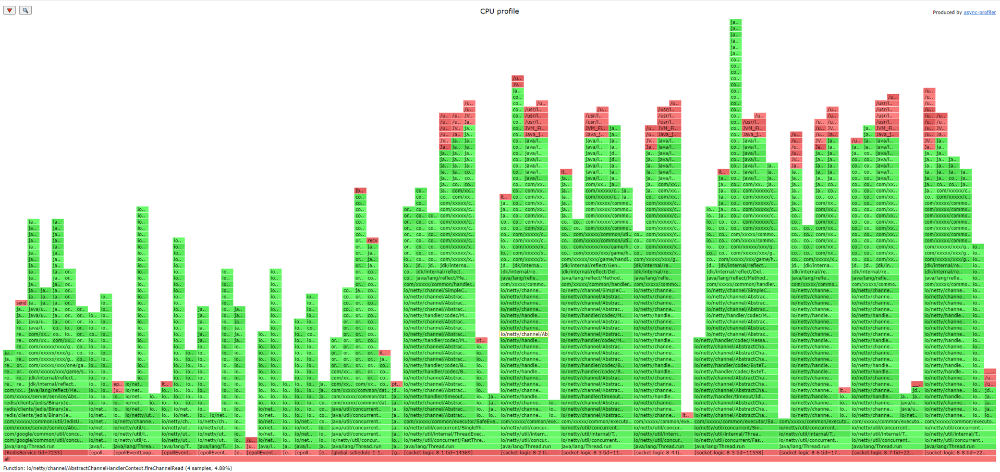

[中文版](README_ZH.md) | English

# Jvmm

Jvmm is a lightweight and secure Java Virtual Machine monitor. You can use it to perform at runtime (Runtime): JVM monitoring (memory, cpu, gc, thread, etc.), OS monitor (cpu, memory, disk ,basic info, etc.), execution, flame graph generation, etc. It is more suitable for service status monitoring, debugging, and performance testing.

# Quick start

Go to the **tag** page and download jvmm, unzip and execute:
```shell
#  Attach to the process running on port 8080
./jvmm-c -m attach -p 8080
```

In the target process, the log will prompt the running port, the default is 5010.

Connect Jvmm, then get system and thread information:
```shell
./jvmm-c -h 127.0.0.1:5010
[Jvmm] [Info ] Start to connect jvmm agent server...
[Jvmm] [Info ] Connect successful! You can use the 'help' command to learn how to use. Enter 'exit' to safely exit the connection.
> info -t systemDynamic
{
   "committedVirtualMemorySize":3218759680,
   "freePhysicalMemorySize":556617728,
   "freeSwapSpaceSize":0,
   "processCpuLoad":0.0,
   "processCpuTime":9110000000,
   "systemCpuLoad":0.0,
   "loadAverage":0.19,
   "totalPhysicalMemorySize":8366346240,
   "totalSwapSpaceSize":0,
   "bufferCacheSize":1917852,
   "sharedSize":12160,
   "disks": [
      {
         "name":"/",
         "total":63278391296,
         "usable":47176683520
      }
   ]
}
> info -t thread
{
   "peakThreadCount":39,
   "daemonThreadCount":25,
   "threadCount":34,
   "totalStartedThreadCount":52
}
> exit
[Jvmm] [Info ] bye bye...
```

Generate flame graph on linux and unix:
```shell
> profiler -f profiler.html
Write profiler to file successful, path is /home/jvmm/profiler.html
```

You will get a flame graph file like this.



# More Usage

This project provides three ways to choose from: `java agent`, `java API`, and `Server service`. I made a `client commandline tool` to connect with the server.*In future versions, it will support web client.*

## Client Tool

The `jvmm-c | jvmm-c.bat` file is a packaged script to quickly run the client. The jar packages used are all files in the same directory. If your application scenario needs to use jar packages from other path, you need to use `java -jar jvmm-client.jar [gars...]` to customize the specification, the more usage is as follows:

The client command line tool has two modes: `Attach` and `Client`. To use it, you must first select a mode to enter. You can view the help like this
```shell
java -jar jvmm-client.jar -help
```

You will see:
```
Command usage-
Below will list all of parameters. You need choose running mode firstly.

 -help       Help information.
 -m <mode>   Choose action mode: 'client' or 'attach', default value is client

Attach mode-
Attach jvmm server to another java program in this computer.

 -a <agentJarFile>    The path of the 'jvmm-agent.jar' file. Support relative path, absolute path and network address.
 -c <config>          Agent startup configuration parameters, if not filled in, the default configuration will be used.
 -p <port>            Target java program listening port. If pid is not filled in, this parameter is required.
 -pid <pid>           The pid of target java program. If port is not filled in, this parameter is required.
 -s <serverJarFile>   The path of the 'jvmm-server.jar' file. Support relative path, absolute path and network address.

Client mode-
Connect to jvmm server and execute some commands.

 -h <address>       The address that will connect to the Jvmm server, like '127.0.0.1:5010'.
 -pass <password>   Jvmm server authentication password. If the target jvmm server is auth enable.
 -user <username>   Jvmm server authentication account. If the target jvmm server is auth enable.
```

**Client mode commands**

After entering the Client mode and successfully connecting with the jvmm server, you will be able to use the following command (type help to view):
```
You can use the following command in client mode.

profiler: -
Get server sampling report. Only supported on MacOS and Linux.
 -c <counter>    Sample counter type, optional values: samples, total. Default value: samples.
 -e <event>      Sample event, optional values: cpu, alloc, lock, wall, itimer. Default value: cpu.
 -f <file>       Output file path (required *), supported file type: csv, html, jfr.
 -i <interval>   The time interval of the unit to collect samples, the unit is nanosecond. Default value: 10000000 ns.
 -t <time>       Sampling interval time, the unit is second. Default value: 10 s.

gc: -
Execute gc, no arguments.

jps: -
View all java processes running on this physical machine.

shutdown: -
Shutdown jvmm server, no arguments.

info: -
Get information about the target server
 -f <output>   File path (optional), output info to file.
 -t <type>     Info type (required *), optional values: system, systemDynamic, classloading, compilation, gc, process, memory,
               memoryManager, memoryPool, thread, threadStack.
```

## Use Agent

Jvmm provides the java agent. You can add parameters to load Jvmm when the monitored program (here called the host program) starts, such as:`-agentpath:/path/jvmm-agent.jar=/path/jvmm-server.jar;config=config.yml`.

If the host program has been started and it is not convenient to restart, you can also use the Client to dynamically attach the agent and server into the host program. The client tool not only supports the loading function, but also supports communication with the jvmm server, but the client only provides some simple commands, and more and more complete functions need to call the API.

You can go to [tag](tags) page and download packaged program. After decompression, you will see these files:

```
|-- jvmm-agent.jar      //  Agent jar, responsible for loading the server into the host program virtual machine.
    jvmm-server.jar     //  Server jar, provide external web interface services.
    jvmm-client.jar     //  Client jar, command line tool, responsible for loading agent and server into host program.
    jvmm-c              //  Client tool for unix environment, encapsulated from client jar.
    jvmm-c.bat          //  Client tool for windows environment, encapsulated from client jar.
    config.yml          //  Server config file.
```

### Dynamically Attach Agent

Execute the client toolkit, choose one of the following commands
```
//  Attach agent into the program running on port 8080
java -jar jvmm-client.jar -m attach -a ./jvmm-agent.jar -s ./jvmm-server.jar -c config=./config.yml -p 8080

//  Attach the agent to the program with the pid of 15000
java -jar jvmm-client.jar -m attach -a ./jvmm-agent.jar -s ./jvmm-server.jar -c config=./config.yml -pid 15000

//  Do not refer to config.yml to define the configuration separately, and the unfilled configuration will use the default value
java -jar jvmm-client.jar -m attach -a ./jvmm-agent.jar -s ./jvmm-server.jar -c name=jvmm_test;port.bind=9000;port.autoIncrease=false -pid 15000
```

If you think the command line is too long, you can also use the `jvmm-c` executable program to achieve the same effect. You only need to modify the config.yml in the same level directory and pass in the host program running port or process number pid.

Run in Linux or Mac
```shell
./jvmm-c -p 8080

./jvmm-c -pid 15000
```

Run in windows
```
jvmm-c.bat -p 8080

jvmm-c.bat -pid 15000
```

### Startup Attach Agent

Just add parameters at startup, for example:
```
//  Reference configuration file
java -agentpath:/path/jvmm-agent.jar=/path/jvmm-server.jar;config=/path/config.yml ...

//  Parameter configuration
java -agentpath:/path/jvmm-agent.jar=/path/jvmm-server.jar;name=jvmm_test;port.bind=9000;port.autoIncrease=false ...
```

### Config

The configuration file supports `Yaml` and `Properties` file formats. Of course, it also supports parameter configuration (see the example above for the method). The following are all configuration items and default configuration values.

example of yml file 
```yaml
name: jvmm_server
port:
  bind: 5010
  autoIncrease: true

http:
  maxChunkSize: 52428800

security:
  enable: false
  account: 
  password: 

log:
  level: info
  useJvmm: false

workThread: 1
```

example of properties file
```properties
name=jvmm_server

port.bind=5010
port.autoIncrease=true

http.maxChunkSize=52428800

security.enable=false
security.account=
security.password=

log.level=info
log.useJvmm=false

workThread=1
```

## API Call

If you want to call the interface in your own program, Jvmm also provides a corresponding solution.

Maven dependencies
```xml
<dependency>
  <groupId>io.github.tzfun.jvmm</groupId>
  <artifactId>jvmm-core</artifactId>
  <version>${jvmmVersion}</version>
</dependency>
```

or

Gradle dependencies
```gradle
implementation "io.github.tzfun.jvmm:jvmm-core:${jvmmVersion}"
```

**Quick start**

```java
import org.beifengtz.jvmm.core.JvmmCollector;
import org.beifengtz.jvmm.core.JvmmExecutor;
import org.beifengtz.jvmm.core.JvmmFactory;
import org.beifengtz.jvmm.core.JvmmProfiler;
import org.beifengtz.jvmm.core.entity.mx.ClassLoadingInfo;
import org.beifengtz.jvmm.core.entity.mx.CompilationInfo;
import org.beifengtz.jvmm.core.entity.mx.GarbageCollectorInfo;
import org.beifengtz.jvmm.core.entity.mx.MemoryInfo;
import org.beifengtz.jvmm.core.entity.mx.MemoryManagerInfo;
import org.beifengtz.jvmm.core.entity.mx.MemoryPoolInfo;
import org.beifengtz.jvmm.core.entity.mx.ProcessInfo;
import org.beifengtz.jvmm.core.entity.mx.SystemDynamicInfo;
import org.beifengtz.jvmm.core.entity.mx.SystemStaticInfo;
import org.beifengtz.jvmm.core.entity.mx.ThreadDynamicInfo;
import org.beifengtz.jvmm.core.entity.profiler.ProfilerCounter;
import org.beifengtz.jvmm.core.entity.profiler.ProfilerEvent;

import java.io.File;
import java.util.List;
import java.util.concurrent.ExecutionException;
import java.util.concurrent.Future;
import java.util.concurrent.TimeUnit;
import java.util.concurrent.TimeoutException;

public class ApiCallDemo {
    public static void main(String[] args) {
        //  The jvmm collector can obtain the following information:
        //  Operating system: basic information, Memory, CPU, Process information
        //  JVM: Memory, GC, Class, Thread, Compilation information
        JvmmCollector collector = JvmmFactory.getCollector();

        MemoryInfo memory = collector.getMemory();
        List<MemoryManagerInfo> memoryManager = collector.getMemoryManager();
        List<MemoryPoolInfo> memoryPool = collector.getMemoryPool();
        SystemStaticInfo systemStatic = collector.getSystemStatic();
        SystemDynamicInfo systemDynamic = collector.getSystemDynamic();
        ClassLoadingInfo classLoading = collector.getClassLoading();
        List<GarbageCollectorInfo> garbageCollector = collector.getGarbageCollector();
        CompilationInfo compilation = collector.getCompilation();
        ProcessInfo process = collector.getProcess();
        ThreadDynamicInfo threadDynamic = collector.getThreadDynamic();
        String[] threadsInfo = collector.dumpAllThreads();

        //  The jvmm executor
        JvmmExecutor executor = JvmmFactory.getExecutor();

        executor.gc();
        executor.setMemoryVerbose(true);
        executor.setClassLoadingVerbose(true);
        executor.setThreadContentionMonitoringEnabled(true);
        executor.setThreadCpuTimeEnabled(true);
        executor.resetPeakThreadCount();

        //  The jvmm profiler, only supports MacOS and Linux environments
        JvmmProfiler profiler = JvmmFactory.getProfiler();
        File file = new File("jvmm_test.html");
        //  Sampling cpu information, duration 10 seconds, output with html report
        Future<String> future = JvmmFactory.getProfiler().sample(file, ProfilerEvent.cpu, ProfilerCounter.samples, 10, TimeUnit.SECONDS);

        try {
            //  The waiting time is recommended to be longer than the sampling time
            future.get(12, TimeUnit.SECONDS);
        } catch (InterruptedException | ExecutionException | TimeoutException e) {
            e.printStackTrace();
        }
    }
}
```

## Server Service

If you want to start as a service in your project, you can use the server module provided by this project. Some collecting information interfaces support circular reading in the server.

For the sake of access security, Jvmm has constructed a unique communication protocol. Even if the identity authentication is not turned on, it cannot communicate with the server without using the *JvmmConnector*. Of course, it is recommended that you turn on the identity authentication in actual applications.

maven dependencies
```xml
<dependency>
  <groupId>io.github.tzfun.jvmm</groupId>
  <artifactId>jvmm-server</artifactId>
  <version>${jvmmVersion}</version>
</dependency>
```

or

gradle dependencies
```gradle
implementation "io.github.tzfun.jvmm:jvmm-server:${jvmmVersion}"
```

**Quick start**

Start server for example:

```java
import org.beifengtz.jvmm.core.conf.Configuration;
import org.beifengtz.jvmm.server.ServerBootstrap;

public class ServerBootDemo {
    public static void main(String[] args) throws Throwable {
        Configuration config = Configuration.newBuilder()
                .setName("jvmm_server_test")
                .setPort(5010)
                .setAutoIncrease(true)
                .setHttpMaxChunkSize(52428800)
                .setLogLevel("info")
                .setLogUseJvmm(true)
                .setSecurityEnable(true)
                .setSecurityAccount("jvmm_acc")
                .setSecurityPassword("jvmm_pwd")
                .setWorkThread(2)
                .build();
        ServerBootstrap server = ServerBootstrap.getInstance(config);
        server.start();

        Thread.sleep(3000);

        server.stop();
    }
}
```

Sample code for connect with server:
```java
package org.beifengtz.jvmm.demo;

import io.netty.channel.EventLoopGroup;
import io.netty.util.concurrent.Future;
import org.beifengtz.jvmm.convey.GlobalType;
import org.beifengtz.jvmm.convey.channel.JvmmServerChannelInitializer;
import org.beifengtz.jvmm.convey.entity.JvmmRequest;
import org.beifengtz.jvmm.convey.socket.JvmmConnector;

import java.util.Objects;
import java.util.concurrent.TimeUnit;

public class ServerConveyDemo {
    public static void main(String[] args) throws InterruptedException {
        EventLoopGroup executor = JvmmChannelInitializer.newEventLoopGroup(1);
        JvmmConnector connector = JvmmConnector.newInstance("127.0.0.1", 5010, executor, false, "jvmm_acc", "jvmm_pwd");
        Future<Boolean> f1 = connector.connect();
        if (f1.await(3, TimeUnit.SECONDS)) {
            if (f1.getNow()) {

                connector.registerCloseListener(() -> {
                    System.out.println("Jvmm connector closed");
                    executor.shutdownGracefully();
                });

                connector.registerListener(response -> {
                    if (Objects.equals(response.getType(), GlobalType.JVMM_TYPE_PONG.name())) {
                        System.out.println("pong");
                        connector.close();
                    }
                });

                connector.send(JvmmRequest.create().setType(GlobalType.JVMM_TYPE_PING));
            } else {
                System.err.println("Authentication failed!");
            }
        } else {
            System.err.println("Connect time out");
        }
    }
}
```

# QAS

## 1.`kernel.perf_event_paranoid` permission switch
If you are prompted `No access to perf events. Try --fdtransfer or --all-user option or 'sysctl kernel.perf_event_paranoid=1'`when generating the flame graph, the reason is that the system kernel disables the detection of system performance by default, you need to enable this option.

```shell
sudo systcl -w kernel.perf_event_paranoid=1
```

Or modify the sysctl file

```shell
sudo sh -c 'echo "kernel.perf_event_paranoid=1" >> /etc/sysctl.conf'
sudo sysctl -p
```

# Thanks

* profiler support: [https://github.com/jvm-profiling-tools/async-profiler](https://github.com/jvm-profiling-tools/async-profiler)
* Source of inspiration and reference: [https://github.com/alibaba/arthas](https://github.com/alibaba/arthas)
