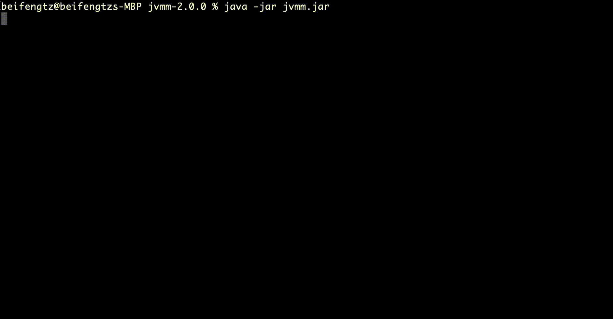

## 一、关于Jvmm客户端

使用客户端之前请先下载好程序包，下载方法见[获取Jvmm客户端](../README.md#获取Jvmm客户端)

### 功能介绍

* 支持向本地任意一个Java进程装载Jvmm，并启动或关闭多个Jvmm服务
* 支持连接远程jvmm服务，并向其发起采集数据、gc、生成火焰图、关闭等指令
* 生成Java Agent所需的jar包，使用Java Agent时需使用客户端生成依赖jar，详情见[Agent使用文档](../agent/README.md)

## 二、使用

客户端工具提供有两种方式供你使用

### 引导式执行

引导式填写参数，你只需要不带任何参数执行jar包然后根据引导提示进行，第一步是模式选择，进入不同的模式填写的参数也会不一样。

```shell
java -jar jvmm.jar
```



### 命令式执行

命令式执行是在命令行后预填好参数，一次执行。

```shell
java -jar jvmm.jar -m attach -c ./config.yml -pid 12345
```

## 三、3种模式使用

### 装载

装载模式可以向本地任意一个正在运行的Java进程装载Jvmm，并根据配置文件配置启动或关闭服务

引导式执行时需**注意第一步模式请选择attach**，而命令式执行需要通过`-m attach`参数指定进入装载模式，其余参数说明如下：

* `-c`：配置文件路径，可以是本地文件路径，也可以是一个http(s)的网络地址，必填
* 指定目标Java进程，以下两个参数二选一即可：
  * `-pid`：目标Java进程的pid，建议使用
  * `-p`：目标Java进程正在监听的 TCP 端口
* `-a`：指定agent jar包，可以是本地文件路径，也可以是一个http(s)的网络地址。选填，默认使用Jvmm客户端生成的jar包
* `-s`：指定server jar包，可以是本地文件路径，也可以是一个http(s)的网络地址。选填，默认使用Jvmm客户端生成的jar包

命令示例
```shell
java -jar jvmm.jar -m attach -c ./config.yml -pid 12345

java -jar jvmm.jar -m attach -c ./config.yml -p 8080

java -jar jvmm.jar -m attach -c http://jvmm.beifengtz.com/config.yml -pid 12345

java -jar jvmm.jar -m attach -c ./config.yml -pid 12345 -a ./jvmm-agent.jar -s ./jvmm-server.jar
```

#### 配置文件

详细配置见[config.yml](../server/src/main/resources/config.yml)

允许重复向同一个进程装载jvmm，其中的service服务会以**差量启停**的方式进行，差量处理的标准是以配置文件中的`server.type`为标准的，以下流程作为示例解释：

> **step 1**：server.type配置为 *jvmm,http,sentinel*，执行后将启动 **jvmm**、**http**、**sentinel** 3 个服务
> 
> **step 2**：server.type配置为 *jvmm,http*，执行后将关闭sentinel服务，jvmm和http服务无影响
> 
> **step 3**：server.type配置为 *none*，执行后将关闭所有服务
> 
> **step 4**：server.type配置为 *jvmm,http*，执行后将启动**jvmm**和**http** 2 个服务

### 连接

假设你已经在一个Java进程中启动了jvmm server（配置的`server.type`为**jvmm**），无论这个进程在本地机器上还是远程机器上，你都可以使用客户端连接模式与其建立联系，并执行一些指令

引导式执行时请选择client，命令式执行通过`-m client`参数指定进入，其余参数说明如下：

* `-h`：连接地址，IP + 端口，例如`127.0.0.1:5010`
* `-user`：身份认证用户名，选填，如果jvmm server开启了身份认证需填写
* `-pass`：身份认证密码，选填，如果jvmm server开启了身份认证需填写

命令示例
```shell
java -jar jvmm.jar -m client -h 127.0.0.1:5010
```

如果连接成功你将看到如下提示，接下来将进入连接模式与jvmm server进行指令交互
```
[Jvmm] [Info ] Start to connect jvmm agent server...
[Jvmm] [Info ] Connect successful! You can use the 'help' command to learn how to use. Enter 'exit' to safely exit the connection.
>
```

#### 连接模式指令

1. **info** 采集信息指令
   * `-t`: 必填，采集信息类型，允许值：system, systemDynamic, classloading, compilation, gc, process, memory, memoryManager, memoryPool, thread, threadStack
   * `-f`: 选填，将采集信息结果输出到文件，不填此值将输出到终端

```shell
info -t system

info -t threadStack -f thread_dump.txt
```

2. **profiler** 生成火焰图指令
    * `-c`，采样类型，允许值：samples、total，默认值为samples
    * `-e`，采样事件，允许值：cpu、alloc、lock、wall、itimer，或者是Java方法，格式为ClassName.MethodName，例如：java.lang.Object.toString，默认值为cpu
    * `-f`，采样输出文件，文件后缀名为格式化类型，允许后缀类型：html、txt、jfr，如果不填此参数将默认输出文本内容
    * `-i`，采样单位间隔，单位纳秒，默认值 10000000ns
    * `-t`，采样时间，单位秒，默认值 10s

```shell
profiler

profiler -f profiler.html

profiler -e wall -f profiler.html -t 120
```


3. **gc** 执行gc，无参数
4. **jps** 列出Java进程，无参数
5. **jtool** 执行Java tools工具命令，前提是你的环境中可以执行：jps、jstack、jstat、jinfo、jmap、jcmd

```shell
jtool jstat -gc 15243
```

6. **shutdown** 关闭正在运行的目标服务
   * `-t`：必填，服务类型，可选值：jvmm、http、sentinel

### 生成Agent依赖Jar

如果你需要在启动时装载jvmm，而不是运行时装载，需要在进程启动参数中添加`-javaagent`参数来指定agent jar包，本工具的jar模式则是生成jvmm agent所需要的jar包

jar模式的作用仅仅是生成两个jar包：jvmm-agent.jar 和 jvmm-server.jar，具体使用方法请前往[Agent使用文档](../agent/README.md)

```shell
java -jar jvmm.jar -m jar
```

7. **jad** 代码反编译（仅支持以agent方式载入jvmm的时候使用）
    * `-c`：必填，需要反编译的类路径，例如java.lang.Object
    * `-m`：指定只获取类中的方法，如果不填默认输出整个类源码
    * `-f`：将源码输出到文件，如果不填默认输出在控制台

```shell
jad -c java.lang.Object

jad -c java.lang.Object -m toString

jad -c java.lang.Object -f Object.java
```
